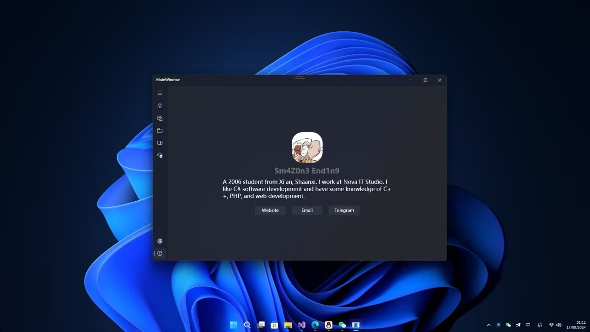
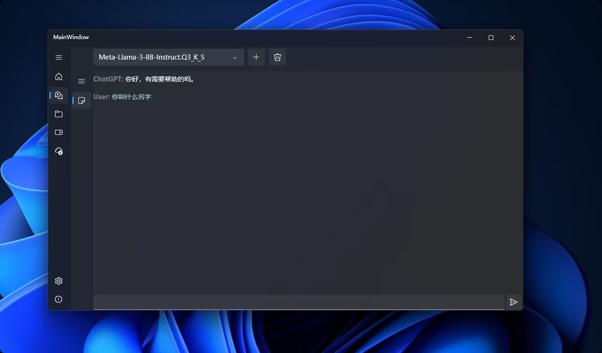
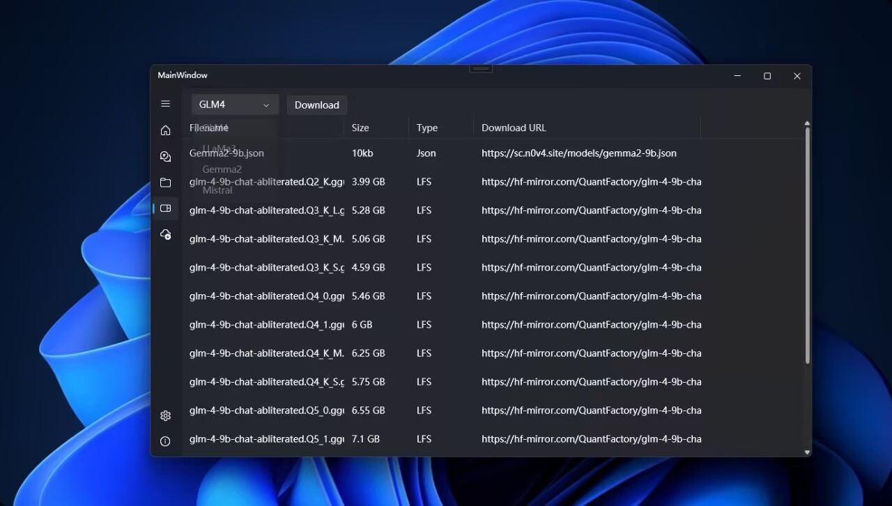

### 介绍
NovaLLaMa 是一个功能强大的 gguf 文件模型加载器，旨在为开发者提供一个高效、灵活的工具来加载和管理各种类型的 gguf 模型。该项目使用 C# WPF 开发，并采用了 inkore.net ui-wpf-modern 的 FluentUI 框架，以提供现代化的用户界面。

### 主要功能

* **多类型 gguf 模型支持：** 支持加载多种不同类型的 gguf 模型，以满足各种应用场景的需求。
* **云端模型下载：** 支持从云端下载模型，方便用户获取最新的模型资源。
* **本地模型加载：** 支持加载本地磁盘上的模型文件，方便用户管理自己的模型库。
* **模型会话管理：** 提供模型会话管理功能，方便用户在多个模型之间切换。
* **模型对话：** 支持与加载的模型进行对话，实现人机交互。
* **多线程下载模型：** 支持多线程下载模型，提高下载速度。
* **类 WinUI3 用户界面：** 采用 FluentUI 框架，提供现代化、美观的用户界面。

### 技术栈

* **开发语言：** C#
* **框架：** WPF
* **UI框架：** inkore.net ui-wpf-modern (FluentUI)

### 安装与使用

1. **克隆项目：**
   ```bash
   git clone https://github.com/SmaZone2020/NovaLLaMa.git
   ```
2. **运行项目：**
   * 打开解决方案文件 (.sln)
   * 使用 Visual Studio 或其他 IDE 运行项目

### 贡献

欢迎为 NovaLLaMa 项目贡献代码！请遵循以下步骤：

1. Fork 本项目
2. 创建新的分支
3. 提交你的修改
4. 创建 Pull Request

### 联系方式

* **GitHub:** [https://github.com/SmaZone2020/NovaLLaMa](https://github.com/SmaZone2020/NovaLLaMa)
* **邮箱:** [smazone@outlook.com](mailto://smazone@outlook.com)

* **链接：** `[GitHub](https://github.com/SmaZone2020/NovaLLaMa)`
* **图片：**






# 注意
本项目使用[LLamaSharp](https://github.com/SciSharp/LLamaSharp)库驱动，并遵循其开源协议
